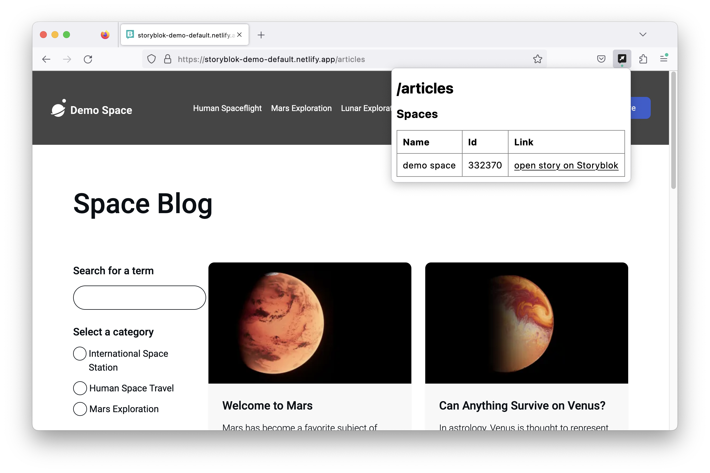

# Storyblok Tools Extension

This browser extension provides a link from your website's page to a Storyblok story for that page.

## Firefox

[Install an extension from file](https://support.mozilla.org/en-US/kb/find-and-install-add-ons-add-features-to-firefox#w_how-do-i-find-and-install-add-ons). The file is `web-ext-artifacts/*.xpi`.

## Chrome

Clone the repository and [install an unpacked extension](https://stackoverflow.com/a/24577660).
